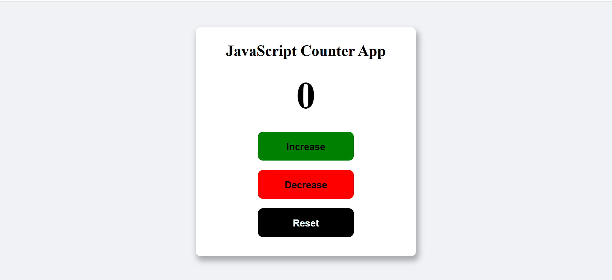

## Preview

# JavaScript Counter App

A simple counter application built using HTML, CSS, and JavaScript.

## Features

- Increase Counter
- Decrease Counter
- Reset Counter
- Counter cannot go below 0
- Counter cannot exceed 10
- Hover animations
- Responsive card layout

## Technologies Used

- HTML5
- CSS3
- JavaScript (DOM)

## Concepts Practiced

- DOM Manipulation
- Event Listeners
- Functions
- Variables
- CSS Transitions
- CSS Hover Effects

## Author

Piyush Kumar
